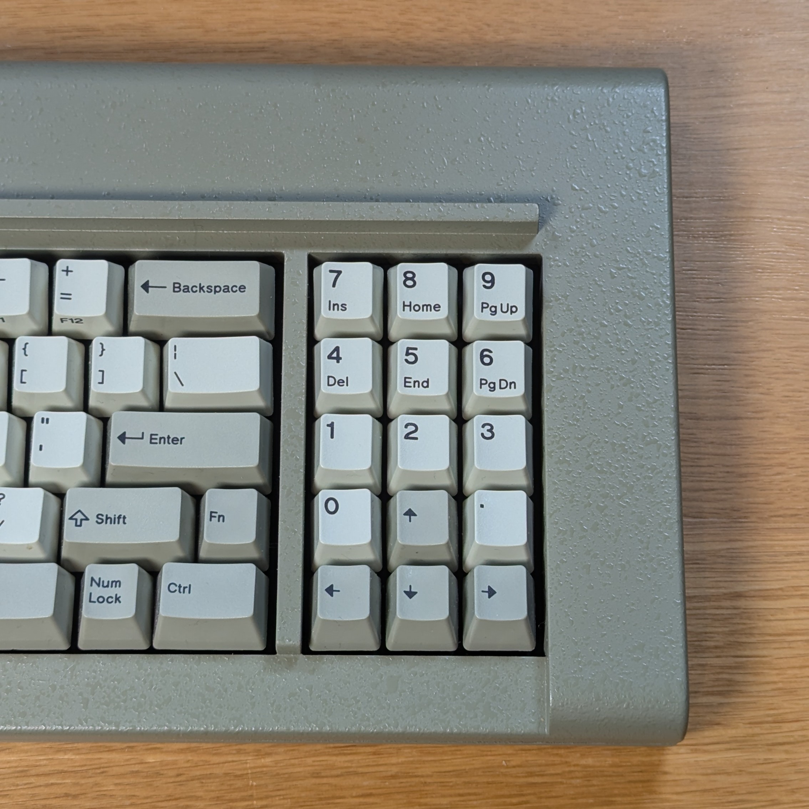
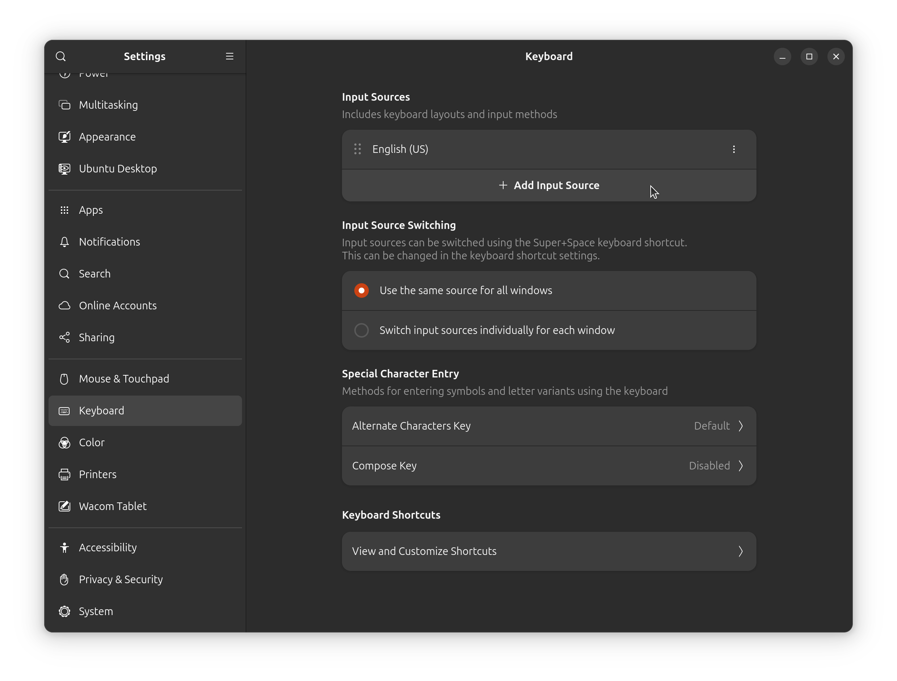
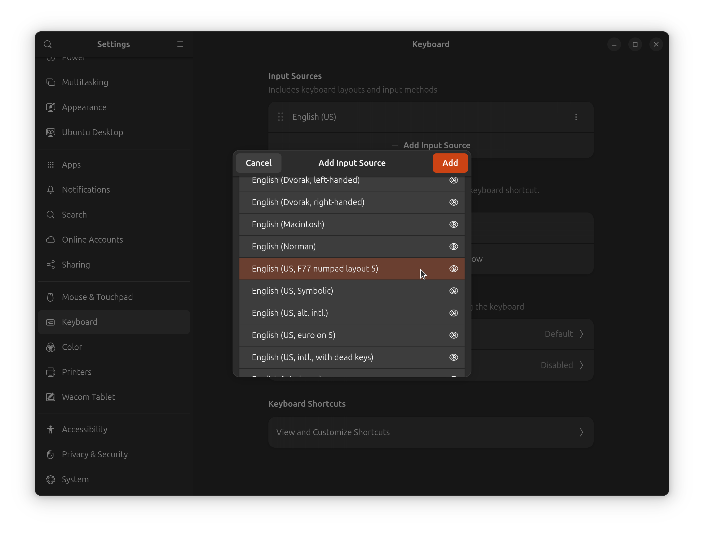
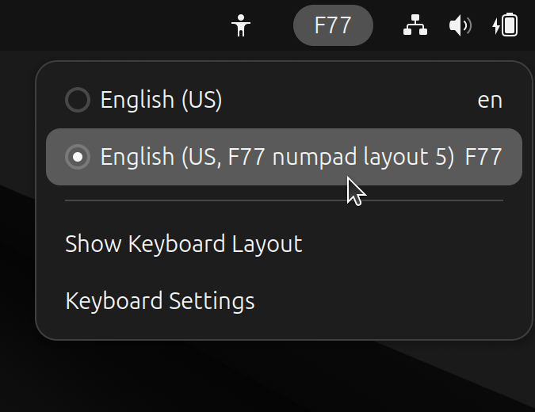

# Custom xkb configuration for the F77's right side block

I have an F77 keyboard from [Model F
Labs](https://www.modelfkeyboards.com/) and I've chosen "layout 5" for
the right side block (see photo above). It's a slightly unusual way of
combining a numpad with a nav cluster, so a little bit of custom
configuration is required to make it work. This repo contains my `xkb`
configuration files, which I use on Ubuntu/GNOME.

There are two reasons why this numpad layout requires a custom configuration:

1. Num Lock is handled by the operating system, not the keyboard.
2. The standard numpad layout is: 1-end, 2-down, 3-pgdn, ..., 9-pgup.

When you press, say, numpad 7 on your keyboard, it sends `KP7` to your
computer, and your computer converts that to either `KP_Home` or
`KP_7`, depending on the current Num Lock status. So it's different
than a keyboard layer, which is handled by the keyboard's
firmware. You can easily observe that this is how Num Lock behaves by
connecting an external keyboard to a laptop: pressing Num Lock on
either the external or the built-in keyboard toggles the LED on both
keyboards. The F77 has programmable firmware, so an alternative
solution is to use layers for the right side block, but if you want to
use Num Lock as a toggle then you need to configure that in the
computer's OS, not in the keyboard's firmware.

On Linux, you can use customize the keyboard layout with `xkb`. I
followed the instructions from [this blog
post](https://codeaffen.org/2023/09/16/custom-keyboard-layouts-with-xkb/),
by [cmeissner](https://github.com/cmeissner). The great thing about
[cmeissner](https://github.com/cmeissner)'s instructions is that they
don't involve changing any system files: you only have to add some
files into your `~/.config` directory.

# Installation instructions

(Tested on Ubuntu 24.10 with GNOME 47, running Wayland.)

## Step 1: add files to `~/.config`

```
git clone https://github.com/kevinbackhouse/ModelF-F77-xkb-config.git
cp -r ModelF-F77-xkb-config/xkb ~/.config/
```

## Step 2: log out of GNOME and log back in

## Step 3: update keyboard settings

Open the settings dialog box and find the keyboard section:



Click "add input source", and search for the new "F77" layout:



Click the layout switch tray icon and select the F77 layout:


